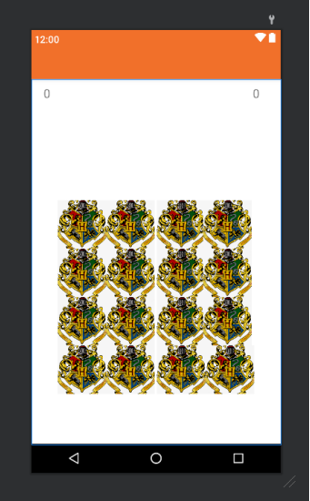

# Memory Matching Game with Android App

This project involves developing a memory matching game Android application using Kotlin in Android Studio. The game includes login/signup functionality and offers single player and multiplayer modes with varying difficulty levels.

## Technologies Used:
- Android Studio
- Kotlin
- Java Development Kit (JDK)

## Project Structure and Features:

### Login/Signup Section:
- Implemented a login/signup interface with text fields for username and password.
- Includes options to sign up for a new account or reset a forgotten password.

### Game Modes:
- **Single Player Mode**:
  - Allows the user to choose between different difficulty levels: Easy (2x2 grid), Normal (4x4 grid), and Hard (6x6 grid).
  - Displays a timer at the top right to track remaining time.
  - Shows the user's score at the top left.
  - Gameplay mechanics involve flipping cards to match pairs. Correct matches earn points (+2 points), while incorrect matches result in point deductions (-1 point). Players start with 0 points and cannot go below 0 points.
  - Background music plays during the game, and players can toggle the music on/off.
  - Different songs play upon making correct matches, completing the game, or running out of time.

- **Multiplayer Mode**:
  - Displays scores for both Player 1 and Player 2 at the top.
  - Follows the same gameplay mechanics as single player mode but alternates turns between Player 1 and Player 2 based on correct or incorrect matches.
  - Background music and song triggers are consistent with single player mode.

## Project Implementation Details:

### User Interface:
- Utilized Android Studio's XML layout files to design the login/signup screens and game interfaces.
- Integrated interactive elements such as buttons, text views, and music controls.

### Game Logic:
- Implemented game logic using Kotlin, handling card flips, matching, scoring, and timer functionalities.
- Used data structures to manage game state, track scores, and control turn-based gameplay in multiplayer mode.

